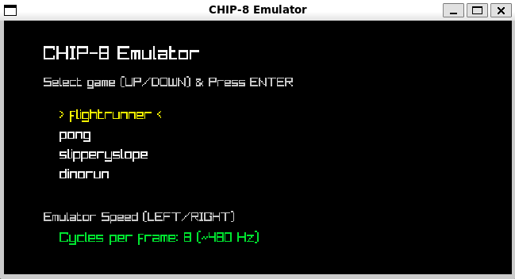
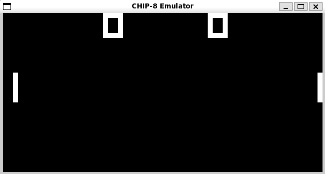
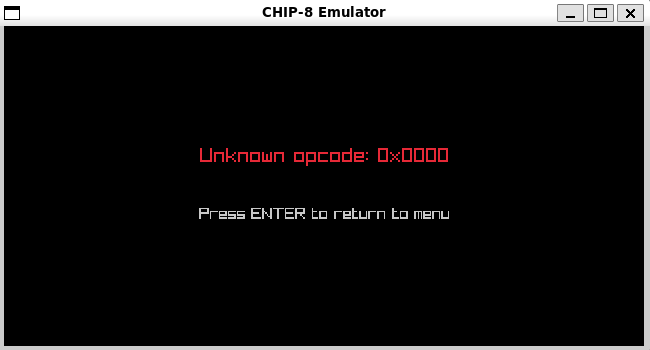

# Chip-8 Emulator
This is Chip8 emulator written in C using raylib. It has some preinstalled games. Some other games can be found here [https://johnearnest.github.io/chip8Archive/]. 
To add new games you need to add it into games folder. Then run tools/compress.py to create new c roms header file "roms.h".
After generating new roms.h you need to execute
```bash
./build/make
```

## Building

### For Desktop (Linux, macOS, Windows)

```bash
cmake -B build -S .
cmake --build build
```

### For Web (WebAssembly / Browser)

To compile the project for WebAssembly, you need to have the [Emscripten SDK](https://emscripten.org/) installed and activated.

1. **Configure and Build**:
   ```bash
   emcmake cmake -B build-web -S . -DPLATFORM=Web
   cmake --build build-web
   ```

2. **Run Local Server**:
   Since WebAssembly pages require a local server to load assets and files safely, start a local HTTP server:
   ```bash
   python3 -m http.server --directory build-web 8080
   ```

3. **Open in Browser**:
   Navigate to **[http://localhost:8080/chip8_emulator.html](http://localhost:8080/chip8_emulator.html)** in your web browser.

## Running

### For Linux and MacOs
```bash
./build/chip8_emulator
```

### For Windows open file

```bash
./build/Debug/chip8_emulator.exe
```


## Controls

Use arrows to pick a game (Up / Down) or to change game running speed (Left / Right).
Press ENTER to start a game.
Press ESCAPE to exit a game and go back to the menu.

The default controls are:

1 2 3 4  
Q W E R  
A S D F  
Z X C V

## Screenshots

### Menu



### Pong Game



### Error
If your game has unkown opcode it will print error message and exit back to menu.

